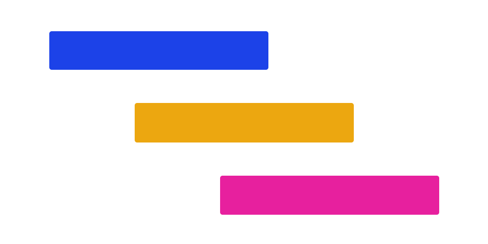

# XGantt



[](https://www.oscs1024.com/project/xpyjs/gantt?ref=badge_small)   [](https://bundlephobia.com/result?p=@xpyjs/gantt-core) [](https://github.com/xpyjs/gantt) [](https://codecov.io/gh/xpyjs/gantt) 
[](https://github.com/xpyjs/gantt/releases) [](https://xpyjs.github.io/gantt/) [](https://github.com/xpyjs/gantt/commits/master) [](https://nodejs.org/)  

[[English](./README.md)] [[中文](./README_cn.md)]

一个功能强大且灵活的甘特图组件库，原生 JS + Canvas 编写，专为现代 Web 应用程序设计，支持 TypeScript。

## 关于版本问题

当前版本是全新开发的，如果您只想使用 `Vue` 版本，我强烈建议您升级到此版本（`@xpyjs/gantt-vue` 适用于 `Vue3`）。
如果您正在寻找以前的版本，请参考 [origin-vue3 分支](https://github.com/xpyjs/gantt/tree/origin-vue3)。

## 📖 简介

甘特图是一种项目管理工具，用于展示项目进度、任务分配和资源利用情况。它以时间轴为基础，通过条形图的形式展示项目中各个任务的开始时间、结束时间、持续时间以及它们之间的依赖关系。

`XGantt` 是一个基于原生 JavaScript 开发的高性能甘特图组件库。它采用 Canvas 技术构建，提供了流畅的用户体验和丰富的功能特性。

## ✨ 特性

- 🚀 **高性能渲染**：基于 Konva.js 的 Canvas 渲染引擎，支持大量数据的流畅显示
- 📊 **多层级表头**：支持表头的多层级展示，便于复杂数据的组织和展示
- ⏱️ **多时间单位**：支持小时、天、周、月、季度等多种时间刻度
- 🔗 **任务依赖管理**：完整的任务依赖关系创建、编辑和可视化
- 🎯 **丰富的交互**：拖拽、缩放、选择、右键菜单等交互功能
- 📅 **多层联动**：支持不同层级之间的数据联动
- 📏 **基线支持**：提供基线功能，用于跟踪项目进度
- 🏁 **里程碑**：支持里程碑标记，便于关键节点的跟踪
- 📊 **虚拟滚动**：支持大数据量的虚拟滚动，保证性能
- 🔄 **事件系统**：完善的事件监听机制，支持业务逻辑集成
- 🖌️ **自定义样式**：丰富的样式和主题配置
- 🛠️ **TypeScript 支持**：完整的类型定义，提供更好的开发体验
- 📦 **多框架支持**：原生 JavaScript，开箱即用，适配所有框架
- 🌐 **国际化支持**：支持多语言支持
- 📚 **全新交互文档**：文档包含详细的教程、API和示例代码 [文档链接](https://docs.xiaopangying.com/gantt/)
- 🔄 **持续更新**：不定期发布新版本，更新功能，修复已知问题，优化性能等

## 🎯 功能

### 核心功能

- **表格视图**：左侧表格区域，支持自定义合并多行多列
- **时间轴**：灵活的时间轴配置，支持多种时间单位和自定义时间范围
- **任务管理**：支持多层级任务结构
- **依赖关系**：可视化的任务依赖线，支持视图中拖拽添加、删除、管理依赖线
- **进度显示**：任务进度条显示，支持百分比和自定义样式

### 交互功能

- **拖拽操作**：任务条拖拽移动和调整大小
- **鼠标操作**：支持行、任务条的点击、双击、右键菜单等操作
- **依赖线**：支持依赖线的创建、编辑和删除

## 📦 安装

### 安装核心包

```bash
npm install @xpyjs/gantt-core
# 或
yarn add @xpyjs/gantt-core
# 或
pnpm add @xpyjs/gantt-core
```

## 🚀 快速开始

### 1. 基本使用

```typescript
import { XGantt } from '@xpyjs/gantt-core';
import '@xpyjs/gantt-core/index.css';

// 准备数据
const taskData = [
  {
    id: 1,
    name: '项目启动',
    startTime: '2024-01-01',
    endTime: '2024-01-05',
    progress: 100
  },
  {
    id: 2,
    name: '需求分析',
    startTime: '2024-01-06',
    endTime: '2024-01-15',
    progress: 80
  },
  {
    id: 3,
    name: '系统设计',
    startTime: '2024-01-16',
    endTime: '2024-01-30',
    progress: 50
  }
];

// 创建甘特图实例
const gantt = new XGantt('#gantt-container', {
  data: taskData
});
```

### 2. HTML 结构

```html
<!DOCTYPE html>
<html>
<head>
  <title>XGantt Demo</title>
</head>
<body>
  <div id="gantt-container" style="width: 100%; height: 600px;"></div>
  <script src="your-script.js"></script>
</body>
</html>
```

### 3. 配置选项

```typescript
const gantt = new XGantt('#gantt-container', {
  // 数据配置
  data: taskData,

  // 时间轴配置
  unit: 'day', // 'hour' | 'day' | 'week' | 'month' | 'quarter'

  // 依赖关系配置
  links: {
    data: [],         // 依赖关系数据
    key: 'id',        // 指定数据的唯一标识字段
    show: true,       // 展示依赖关系
    create: {
      enabled: true,  // 允许在视图中创建依赖关系
      mode: 'hover',  // 鼠标悬停在任务条时展示创建点
      from: true,     // 允许节点作为起始点创建连线
      to: true        // 允许节点作为终点创建连线
    }
  },

  // 日志级别
  logLevel: 'info' // 'debug' | 'info' | 'warn' | 'error' | 'none',

  // ... 其他配置选项
});
```

### 4. 事件监听

```typescript
// 监听任务选择事件
gantt.on('select', (data, checked, all) => {
  console.log('选中的任务:', data);
});

// 监听任务点击事件
gantt.on('click:row', (e, data) => {
  console.log('点击了任务行:', data);
});

// 监听任务条点击事件
gantt.on('click:slider', (e, data) => {
  console.log('点击了任务条:', data);
});

// 监听任务移动事件
gantt.on('move', (data) => {
  console.log('任务移动:', data);
});
```

## 📚 API 参考

### XGantt 类

#### 构造函数

```typescript
new XGantt(element: string | HTMLElement, options?: IOptions)
```

- `element`: 容器元素或选择器
- `options`: 配置选项

#### 方法

##### update(options: IOptions): void

动态更新甘特图配置选项。

```typescript
gantt.update({
  unit: 'month',
  logLevel: 'debug'
});
```

##### render(): void

强制渲染视图。

```typescript
gantt.render();
```

##### destroy(): void

销毁甘特图实例并清理所有资源。

```typescript
gantt.destroy();
```

##### jumpTo(date?: any): boolean

跳转到指定日期的时间轴位置。

```typescript
gantt.jumpTo('2024-06-01');
gantt.jumpTo(new Date());
```

##### on(event: keyof EventMap, callback: Function): void

注册事件监听器。

```typescript
gantt.on('select', (data, checked, all) => {
  // 处理选择事件
});
```

### 配置选项

参考完整的配置选项：[IOptions](./packages/core/src/types/index.d.ts#l7)

### 事件系统

甘特图支持以下事件：

| 事件名称 | 参数 | 描述 |
|----------|------|------|
| `error` | `(error: ErrorType)` | 错误处理 |
| `select` | `(data: any[], checked: boolean, all: any[])` | 任务选择 |
| `click:row` | `(e: MouseEvent, data: any)` | 行点击 |
| `dblclick:row` | `(e: MouseEvent, data: any)` | 行双击 |
| `contextmenu:row` | `(e: MouseEvent, data: any)` | 行右键 |
| `click:slider` | `(e: MouseEvent, data: any)` | 任务条点击 |
| `dblclick:slider` | `(e: MouseEvent, data: any)` | 任务条双击 |
| `contextmenu:slider` | `(e: MouseEvent, data: any)` | 任务条右键 |
| `move` | `(data: {row: any; old: any}[])` | 任务移动 |
| `create:link` | `(link: ILink)` | 依赖关系创建 |
| `update:link` | `(link: ILink)` | 依赖关系更新 |
| `select:link` | `(add: ILink, cancel: ILink, all: ILink[])` | 依赖关系选择 |

参考完整的事件类型：[EventMap](./packages/core/src/types/event.d.ts#l4)

### 工具函数

同时，XGantt 还提供了一些实用的工具函数，方便开发者进行常见操作。

```typescript
import { generateId, dayjs, colorjs } from '@xpyjs/gantt-core';

// 生成唯一 ID
const id = generateId();

// 时间处理（就是 dayjs 包，如果不想安装，可以通过导出使用。已经内置了一些插件，如果需要更多，仍需要单独安装使用）
const now = dayjs();
const formatted = dayjs('2024-01-01').format('YYYY-MM-DD');

// 颜色处理
const color = colorjs('#ff0000');
const rgb = color.alpha(0.5).toRgb(); // 获取 RGB 颜色值 { r: 255, g: 0, b: 0, a: 0.5 }
```

## 框架支持

XGantt 本身可以适配多种前端框架。但是我仍然提供了 `Vue` 和 `React` 的适配包，方便在这些框架中使用。

### Vue 版本

`@xpyjs/gantt-vue` 是专为 Vue 3 设计的适配包，提供了更好的集成和使用体验。

#### 安装

```bash
npm install @xpyjs/gantt-vue
# or
yarn add @xpyjs/gantt-vue
# or
pnpm add @xpyjs/gantt-vue
```

#### 使用

```vue
<template>
  <XGanttVue :options="ganttOptions" />
</template>

<script lang="ts" setup>
import { reactive } from 'vue';
import XGanttVue from '@xpyjs/gantt-vue';
import '@xpyjs/gantt-vue/style.css';

const ganttOptions = reactive({
  data: [
    {
      id: 1,
      name: '项目启动',
      startTime: '2024-01-01',
      endTime: '2024-01-05',
      progress: 100
    },
    {
      id: 2,
      name: '需求分析',
      startTime: '2024-01-06',
      endTime: '2024-01-15',
      progress: 80
    },
    {
      id: 3,
      name: '系统设计',
      startTime: '2024-01-16',
      endTime: '2024-01-30',
      progress: 50
    }
  ],
  unit: 'day',
  table: {
    columns: [
      { label: '任务名称', field: 'name' },
      { label: '开始时间', field: 'startTime' },
      { label: '结束时间', field: 'endTime' },
    ]
  }
});
</script>
```

`@xpyjs/gantt-vue` 已经适配了响应式，所以直接修改数据，就会触发视图自动更新。

### React 版本

`@xpyjs/gantt-react` 是专为 React 设计的适配包，提供了更好的集成和使用体验。

#### 安装

```bash
npm install @xpyjs/gantt-react
# or
yarn add @xpyjs/gantt-react
# or
pnpm add @xpyjs/gantt-react
```

#### 使用

```jsx
import { useState, useCallback, useEffect } from 'react';
import { XGanttReact, useXGantt } from '@xpyjs/gantt-react';
import '@xpyjs/gantt-react/style.css';

function App() {
  const { ganttRef, jumpTo } = useXGantt();

  const [ganttData, setGanttData] = useState([
    {
      id: 1,
      name: '项目启动',
      startTime: '2024-01-01',
      endTime: '2024-01-05',
      progress: 100
    },
    {
      id: 2,
      name: '需求分析',
      startTime: '2024-01-06',
      endTime: '2024-01-15',
      progress: 80
    },
    {
      id: 3,
      name: '系统设计',
      startTime: '2024-01-16',
      endTime: '2024-01-30',
      progress: 50
    }
  ]);

  const ganttOptions: IOptions = {
    data: ganttData,
    table: {
      columns: [
        { label: '任务名称', field: 'name' },
        { label: '开始时间', field: 'startTime' },
        { label: '结束时间', field: 'endTime' },
      ]
    },
    unit: 'day',
  };

  return (
    <div className="app">
      <XGanttReact ref={ganttRef} options={ganttOptions} />
    </div>
  );
}

export default App;
```

`@xpyjs/gantt-react` 提供了一个 hooks：`useXGantt`，方便在函数组件中使用。

## 🔧 浏览器支持

XGantt 基于 HTML5 Canvas 技术构建，只要浏览器支持 Canvas API 即可正常使用：

- **Chrome** >= 51
- **Firefox** >= 45
- **Safari** >= 10
- **Edge** >= 12
- **Internet Explorer** >= 9

> **注意**：XGantt 主要依赖 Canvas 2D Context API，在支持 Canvas 的浏览器中都能良好运行。上述版本要求已经覆盖了绝大部分用户场景。

## 📄 许可证

MIT License

## 🤝 贡献

欢迎贡献！请阅读我们的贡献指南以获取更多信息。

## 📞 支持

- [GitHub Issues](https://github.com/xpyjs/gantt/issues)
- [文档](https://docs.xiaopangying.com/gantt/)

## 🎊 赞助

如果您觉得这个项目不错，可以请作者喝杯咖啡。

<div style="display: flex; gap: 20px; align-items: center;">


</div>

---

Made with ❤️ by the Jeremy Jone
